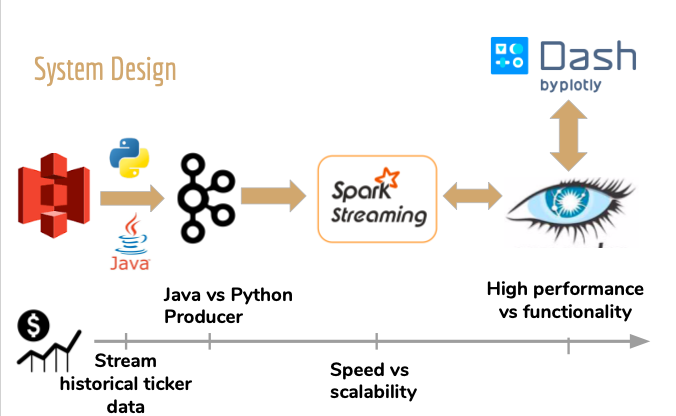

# RiskControl
    ├── README.md
    ├── frontend
    │   └── frontend.py
    ├── ingestion
    │   └── dezip.py
    ├── Database
    |   └── user_generator.py
    └── Spark
        └── pyspark_analysis.py
        └── Jar file
              ├── spark-streaming-kafka-0-8-assembly_2.11-2.4.0.jar
              ├── spark-cassandra-connector_2.11-2.3.0.jar + jsr166e.jar
## Introduction

With the rise of technology and information, stock trading has once again gain popularity.
However,media outlets and social media tend to always publish stories about successful traders
while ignoring stories of people who suffer massive losses. Because of this, the new generation
of traders have a false sense of security and tend to not test their trading strategies. 
My application is allows users to test the viability of their strategy in realtime which helps them
decide whether if a strategy should be pulled or scaled up.
## Tech Stack

## Data Source 
Data was streamed through old trade data from New York Stock Exchange. The file is orignally in gzip file, it was dezip and converted to csv and saved to S3 to be streamed by Kafka producer
### Kafka
Data stream was simulated from historical trades data from New York Stock Exchange and streamed from 
amazon S3 into kafka through python producer script. The messages were fed into 1 kafka topic and everything
was consumed by spark consumer. Kafka cluster consisted of 3 EC2 instances. Producer was written in python but 
a java script was written to compare the streaming rates between python and java. 

### Spark
Spark consumed all messages from kafka. Spark cluster used in this project consisted of 1 master and 3 worker
nodes. Everyhting was wrtting in python(pyspark).Spark pulled user data from Cassandra database before start of 
streaming session and updates to users information as well as historical data are all written to Cassandra database.
Schduled delay was a huge problem in spark streaming because it does not do well in 1 second batch windows. The optimal 
batch time for this project, under 100k users was 8 seconds because batch time was 7.88 seconds. 

### Cassandra 
Cassandra database was chosen because of its relatively read speed and extremely fast write speed. Cassandra had 3 databases. First table was named directory_data and identified usernames to tickers. The second table contained historical movement of the username and is structured to have username as partition key and time as clustering key. This design allows for easier
query in frontend for graphing purposes. The third table contained current updated user information with ticker as partition key and user as clustering key. The cassandra cluster consisted of 3 amazon EC2 instances and the keyspace used for this project contained replication factor of 3. 

## Frontend 
Frontend can accessed through wordqu.xyz. Frontend is dash-based and does query from 3 cassandra tables. The first table is an identifier which matches username with ticker specified in strategy. This is because the partition key of user strategy statistic has stock ticker as partition and user as cluster key.The third cassandra table contain historical data for each user which is graphed in the user interface.

Link to Demonstration video:
https://www.youtube.com/watch?v=uovICvy6P54

Website User Interface: Wordqu.xyz

